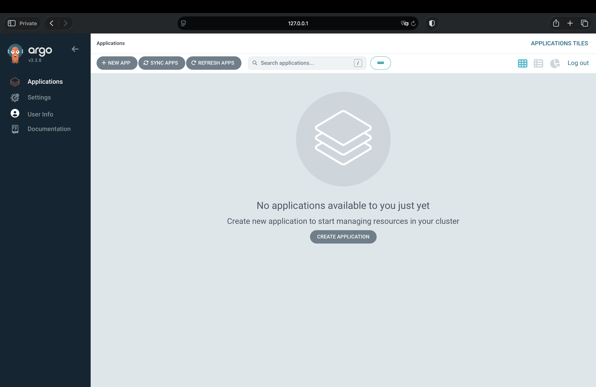

## Выполнение ДЗ № 10

Проверяю, что кластер созданный в прошлом ДЗ жив: 
```bash
c managed-kubernetes cluster list

+----------------------+----------------+---------------------+---------+----------+-----------------------+-------------------+
|          ID          |      NAME      |     CREATED AT      | HEALTH  |  STATUS  |   EXTERNAL ENDPOINT   | INTERNAL ENDPOINT |
+----------------------+----------------+---------------------+---------+----------+-----------------------+-------------------+
| cat264jtvu7s0tk1og8s | my-k8s-cluster | 2026-04-14 16:52:34 | HEALTHY | STARTING | https://111.88.157.60 | https://10.0.0.11 |
+----------------------+----------------+---------------------+---------+----------+-----------------------+-------------------+

There is a new yc version '1.6.0' available. Current version: '1.1.0'.
See release notes at https://yandex.cloud/ru/docs/cli/release-notes
You can install it by running the following command in your shell:
        $ yc components update
```
Обновила: 
```bash
yc components update
```
Проверила: 
```bash
yc managed-kubernetes cluster get --id cat264jtvu7s0tk1og8s
id: cat264jtvu7s0tk1og8s
folder_id: b1gbocdespuklnjtfkbf
created_at: "2026-04-14T16:52:34Z"
name: my-k8s-cluster
status: STARTING
health: HEALTHY
```
Подключилась: 
```bash
kubectl cluster-info

Kubernetes control plane is running at https://111.88.157.60
CoreDNS is running at https://111.88.157.60/api/v1/namespaces/kube-system/services/kube-dns:dns/proxy
```
Проверила ноды: 
```bash
kubectl get nodes

NAME                        STATUS   ROLES    AGE   VERSION
cl1j1on23inasjurbm8h-ozuq   Ready    <none>   11d   v1.32.1
cl1t8pdv6rtd4oqb6ekr-ahav   Ready    <none>   12d   v1.32.1
```
Нода cl1t8pdv6rtd4oqb6ekr-ahav с меткой - infra: 
```bash
Taints:             dedicated=infra:NoSchedule
                    node-role=infra:NoSchedule
```

**Задание: установить в кластер ArgoCD с помощью Helm-чарта:** 
- необходимо сконфигурировать параметры установки так, чтобы компоненты argoCD устанавливались исключительно на infra-ноду (добавить соответствующий toleration для обхода taint, а также nodeSelector или nodeAffinity на ваш выбор, для планирования подов только на заданные поды)
- приложите к ДЗ value.yaml конфигурации установки ArgoCD и команду самой установки чарта. 


Создала ns - argocd
```bash
kubectl create namespace argocd
```
Создала [`values.yaml`](values.yaml): 

Установила argocd через helm: 
```bash
helm repo add argo https://argoproj.github.io/argo-helm
helm repo update
```
```bash
helm install argocd argo/argo-cd \
  --namespace argocd \
  --values values.yaml
```

Проверка: 
```bash
kubectl get pods -n argocd -o wide

NAME                                                READY   STATUS    RESTARTS   AGE   IP              NODE                        NOMINATED NODE   READINESS GATES
argocd-application-controller-0                     1/1     Running   0          87s   10.112.129.26   cl1t8pdv6rtd4oqb6ekr-ahav   <none>           <none>
argocd-applicationset-controller-78cf789548-4ns5h   1/1     Running   0          88s   10.112.129.27   cl1t8pdv6rtd4oqb6ekr-ahav   <none>           <none>
argocd-dex-server-7949f5c6b7-2qsm2                  1/1     Running   0          88s   10.112.129.25   cl1t8pdv6rtd4oqb6ekr-ahav   <none>           <none>
argocd-notifications-controller-5dcb84dd58-qfphv    1/1     Running   0          88s   10.112.129.29   cl1t8pdv6rtd4oqb6ekr-ahav   <none>           <none>
argocd-redis-8558fcb564-lpgll                       1/1     Running   0          88s   10.112.129.24   cl1t8pdv6rtd4oqb6ekr-ahav   <none>           <none>
argocd-repo-server-c894f8cff-fmxdw                  1/1     Running   0          88s   10.112.129.28   cl1t8pdv6rtd4oqb6ekr-ahav   <none>           <none>
argocd-server-6d8c9c8889-tsnxv                      1/1     Running   0          87s   10.112.129.30   cl1t8pdv6rtd4oqb6ekr-ahav   <none>           <none>
nela@Nelas-MacBook-Pro kuberbetes-gitops % 
```

Получаю пароль admin: 
```bash
kubectl -n argocd get secret argocd-initial-admin-secret \
  -o jsonpath="{.data.password}" | base64 -d
echo
```
Открываю UI AgroCD:
```bash
kubectl port-forward svc/argocd-server -n argocd 8080:443
```
Открываю в браузере: 
http://127.0.0.1:8080/




