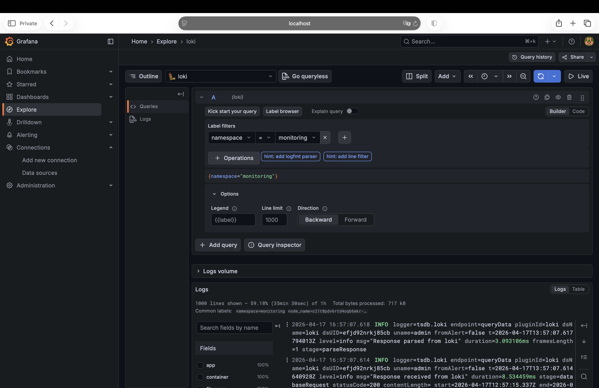
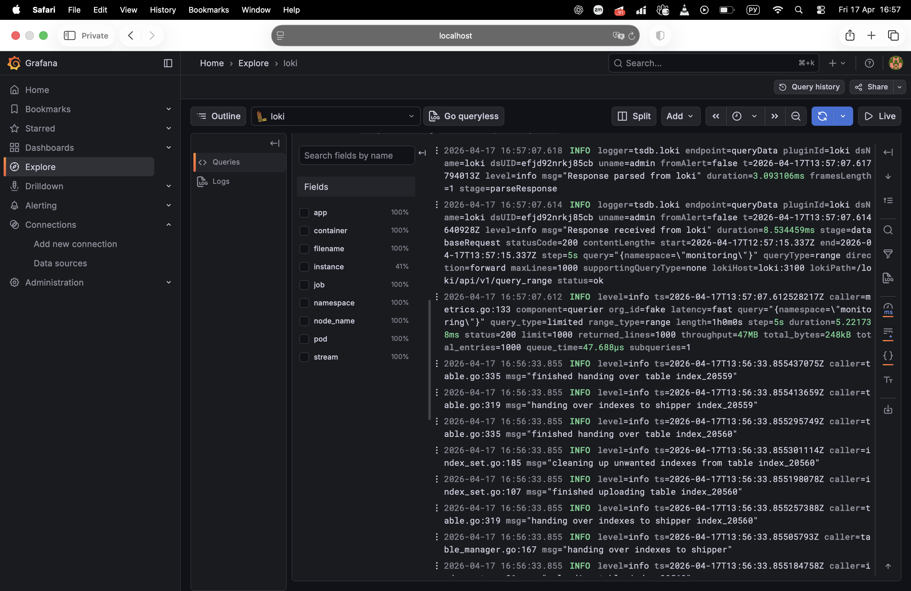

1. Создала папку и VPC-сеть в учеткой записи Yandex cloud
2. Установила Yandex Cloud CLI: 
    curl -sSL https://storage.yandexcloud.net/yandexcloud-yc/install.sh | bash

3. Инициализация: 
     ```bash
     yc config list
token: y0__xD3iunwARjB3RMg4Ye5qxUwmpP-9gdEhbuKQTLEiQexPeBPJ0ZWGygphA
cloud-id: b1gf9tc2sd9jtv1nqa84
folder-id: b1gbocdespuklnjtfkbf
compute-default-zone: ru-central1-a
```
4. Создание кластера через CLI
```bash
yc managed-kubernetes cluster create \
  --name my-k8s-cluster \
  --network-name nela-vlg \
  --zone ru-central1-a \
  --subnet-name subnetwork-715157 \
  --public-ip

yc iam service-account create --name k8s-sa

yc resource-manager folder add-access-binding \
  --id b1gbocdespuklnjtfkbf \
  --role editor \
  --subject serviceAccount:aje8a6b6hef6q8f5pngv

Теперь создаем кластер: 
```bash
yc managed-kubernetes cluster create \
  --name my-k8s-cluster \
  --network-name nela-vlg \
  --zone ru-central1-b \
  --subnet-name subnetwork-715157 \
  --service-account-id aje8a6b6hef6q8f5pngv \
  --node-service-account-id aje8a6b6hef6q8f5pngv \
  --public-ip
```

5. Подключаю kubectl к кластеру: 

```bash
yc managed-kubernetes cluster get-credentials my-k8s-cluster --external
```
Проверка: 
```bash
kubectl cluster-info
```
Пишет, что все ок: 
```bash
Kubernetes control plane is running at https://111.88.157.60
CoreDNS is running at https://111.88.157.60/api/v1/namespaces/kube-system/services/kube-dns:dns/proxy

To further debug and diagnose cluster problems, use 'kubectl cluster-info dump'.
```
6. Создаю node group WORKLOAD (1 нода)
```bash
yc managed-kubernetes node-group create \
  --cluster-name my-k8s-cluster \
  --name workload-nodes \
  --platform-id standard-v3 \
  --fixed-size 1 \
  --cores 2 \
  --memory 4 \
  --disk-size 64 \
  --location zone=ru-central1-b \
  --location zone=ru-central1-b,subnet-id=e2lqj86jtcob2m7e1m0s \
  --node-labels role=workload
```

Создаю INFRA node group: 
```bash 
yc managed-kubernetes node-group create \
  --cluster-name my-k8s-cluster \
  --name infra-nodes \
  --platform-id standard-v3 \
  --fixed-size 1 \
  --cores 2 \
  --memory 4 \
  --disk-size 64 \
  --location zone=ru-central1-b,subnet-id=e2lqj86jtcob2m7e1m0s \
  --node-labels role=infra \
  --node-taints dedicated=infra:NoSchedule
  ```
  
  Проверка: 
  ```bash
  kubectl get nodes
    NAME                        STATUS   ROLES    AGE     VERSION
    cl1ra8oqg7nmt1ugih06-ofyf   Ready    <none>   10m     v1.32.1
    cl1t8pdv6rtd4oqb6ekr-ahav   Ready    <none>   3m19s   v1.32.1
```

7. Проверяю метки нод: 
```bash
kubectl get nodes --show-labels
NAME                        STATUS   ROLES    AGE    VERSION   LABELS
cl1ra8oqg7nmt1ugih06-ofyf   Ready    <none>   12m    v1.32.1   beta.kubernetes.io/arch=amd64,beta.kubernetes.io/instance-type=standard-v3,beta.kubernetes.io/os=linux,failure-domain.beta.kubernetes.io/zone=ru-central1-b,kubernetes.io/arch=amd64,kubernetes.io/hostname=cl1ra8oqg7nmt1ugih06-ofyf,kubernetes.io/os=linux,node.kubernetes.io/instance-type=standard-v3,node.kubernetes.io/kube-proxy-ds-ready=true,node.kubernetes.io/masq-agent-ds-ready=true,node.kubernetes.io/node-problem-detector-ds-ready=true,role=workload,topology.kubernetes.io/zone=ru-central1-b,yandex.cloud/node-group-id=catkf5urtf11r3u2v35l,yandex.cloud/pci-topology=k8s,yandex.cloud/preemptible=false
cl1t8pdv6rtd4oqb6ekr-ahav   Ready    <none>   5m1s   v1.32.1   beta.kubernetes.io/arch=amd64,beta.kubernetes.io/instance-type=standard-v3,beta.kubernetes.io/os=linux,failure-domain.beta.kubernetes.io/zone=ru-central1-b,kubernetes.io/arch=amd64,kubernetes.io/hostname=cl1t8pdv6rtd4oqb6ekr-ahav,kubernetes.io/os=linux,node.kubernetes.io/instance-type=standard-v3,node.kubernetes.io/kube-proxy-ds-ready=true,node.kubernetes.io/masq-agent-ds-ready=true,node.kubernetes.io/node-problem-detector-ds-ready=true,role=infra,topology.kubernetes.io/zone=ru-central1-b,yandex.cloud/node-group-id=catn91386rvjejm3lo68,yandex.cloud/pci-topology=k8s,yandex.cloud/preemptible=false
```

8. для инфраструктурой ноды добавляю taint, запрещающий на нее планирование ходов с посторонней нагрузкой: 
node-role=infra:NoSchedule

```bash
kubectl taint nodes cl1t8pdv6rtd4oqb6ekr-ahav node-role=infra:NoSchedule
```
Проверка: 
```bash
kubectl describe node cl1t8pdv6rtd4oqb6ekr-ahav | grep Taints 
Taints:             dedicated=infra:NoSchedule
```

9. Прикладываю вывод команд по заданию: 
kubectl get node -o wide --show-labels 
и kubectl get nodes -o custom-columns=NAME:.metadata.name,TAINTS:.spec.taints

```bash
kubectl get node -o wide --show-labels 
NAME                        STATUS   ROLES    AGE    VERSION   INTERNAL-IP   EXTERNAL-IP   OS-IMAGE             KERNEL-VERSION       CONTAINER-RUNTIME     LABELS
cl1ra8oqg7nmt1ugih06-ofyf   Ready    <none>   128m   v1.32.1   10.0.0.25     <none>        Ubuntu 22.04.5 LTS   5.15.0-168-generic   containerd://1.7.27   beta.kubernetes.io/arch=amd64,beta.kubernetes.io/instance-type=standard-v3,beta.kubernetes.io/os=linux,failure-domain.beta.kubernetes.io/zone=ru-central1-b,kubernetes.io/arch=amd64,kubernetes.io/hostname=cl1ra8oqg7nmt1ugih06-ofyf,kubernetes.io/os=linux,node.kubernetes.io/instance-type=standard-v3,node.kubernetes.io/kube-proxy-ds-ready=true,node.kubernetes.io/masq-agent-ds-ready=true,node.kubernetes.io/node-problem-detector-ds-ready=true,role=workload,topology.kubernetes.io/zone=ru-central1-b,yandex.cloud/node-group-id=catkf5urtf11r3u2v35l,yandex.cloud/pci-topology=k8s,yandex.cloud/preemptible=false
cl1t8pdv6rtd4oqb6ekr-ahav   Ready    <none>   120m   v1.32.1   10.0.0.5      <none>        Ubuntu 22.04.5 LTS   5.15.0-168-generic   containerd://1.7.27   beta.kubernetes.io/arch=amd64,beta.kubernetes.io/instance-type=standard-v3,beta.kubernetes.io/os=linux,failure-domain.beta.kubernetes.io/zone=ru-central1-b,kubernetes.io/arch=amd64,kubernetes.io/hostname=cl1t8pdv6rtd4oqb6ekr-ahav,kubernetes.io/os=linux,node.kubernetes.io/instance-type=standard-v3,node.kubernetes.io/kube-proxy-ds-ready=true,node.kubernetes.io/masq-agent-ds-ready=true,node.kubernetes.io/node-problem-detector-ds-ready=true,role=infra,topology.kubernetes.io/zone=ru-central1-b,yandex.cloud/node-group-id=catn91386rvjejm3lo68,yandex.cloud/pci-topology=k8s,yandex.cloud/preemptible=false
```

```bash
kubectl get nodes -o custom-columns=NAME:.metadata.name,TAINTS:.spec.taints
NAME                        TAINTS
cl1ra8oqg7nmt1ugih06-ofyf   <none>
cl1t8pdv6rtd4oqb6ekr-ahav   [map[effect:NoSchedule key:node-role value:infra] map[effect:NoSchedule key:dedicated value:infra]]
```

10. Создать бакет в s3 object storage Yandex cloud. В нем будут храниться логи, собираемые loki. Также необходимо создать ServiceAccount для доступа к бакету и сгенерировать ключи доступа согласно инструкции YC. 

- создаю бакет в Object Storage: 
```bash
yc storage bucket create \
  --name loki-logs-bucket-nela

Ответ: 

name: loki-logs-bucket-nela
folder_id: b1gbocdespuklnjtfkbf
anonymous_access_flags: {}
default_storage_class: STANDARD
versioning: VERSIONING_DISABLED
created_at: "2026-04-15T14:52:45.970504Z"
resource_id: e3et26pbkl75kvfo2r1j
```
Проверка: 
```bash
yc storage bucket list


+-----------------------+----------------------+----------+-----------------------+---------------------+
|         NAME          |      FOLDER ID       | MAX SIZE | DEFAULT STORAGE CLASS |     CREATED AT      |
+-----------------------+----------------------+----------+-----------------------+---------------------+
| loki-logs-bucket-nela | b1gbocdespuklnjtfkbf |        0 | STANDARD              | 2026-04-15 14:52:45 |
+-----------------------+----------------------+----------+-----------------------+---------------------+
```
узнаю folder-id:
```bash
yc config get folder-id
b1gbocdespuklnjtfkbf
```

Выдаю права на бакет: 
```bash
yc resource-manager folder add-access-binding b1gbocdespuklnjtfkbf \
  --role storage.editor \
  --subject serviceAccount:aje8a6b6hef6q8f5pngv
```

Получаю ключи: 
```bash
yc iam access-key create --service-account-name k8s-sa
access_key:
  id: ajeh0b0lhmkhmsctautk
  service_account_id: aje8a6b6hef6q8f5pngv
  created_at: "2026-04-15T14:58:17.902255273Z"
  key_id: <XXX>
secret: <YYY>
```

11. Установить в кластер Loki
    - монолитный или распределенный режим (не принципиально)
    - необходимо сконфигурировать параметры установки так, чтобы компоненты loki устанавливались исключительно на infra-ноды (добавить соответствующий toleration для обхода tain, а также nodeSelector или nodeAffinity на ваш выбор, для пранирования подов только на заданные ноды)
    - место хранения логов - s3 бакет, ранее сконфигурированный
    - auth_enable: false

Проверила infra-ноду: 
```bash
kubectl get nodes -l role=infra
NAME                        STATUS   ROLES    AGE    VERSION
cl1t8pdv6rtd4oqb6ekr-ahav   Ready    <none>   163m   v1.32.1
```
Создала namespace: 
```bash
kubectl create namespace monitoring
```
Установила:
```bash
helm repo add grafana https://grafana.github.io/helm-charts
helm repo update
```

Создала файл [`loki-values.conf`](loki-values.conf). 

Установила Loki: 
```bash
helm install loki grafana/loki-stack \
  --namespace monitoring \
  -f loki-values.yaml
```
Получила: 
```
level=WARN msg="this chart is deprecated"
NAME: loki
LAST DEPLOYED: Thu Apr 16 10:54:23 2026
NAMESPACE: monitoring
STATUS: deployed
REVISION: 1
DESCRIPTION: Install complete
NOTES:
The Loki stack has been deployed to your cluster. Loki can now be added as a datasource in Grafana.

See http://docs.grafana.org/features/datasources/loki/ for more detail.
```
Проверка подов: 
```bash
kubectl get pods -n monitoring -o wide

NAME                  READY   STATUS             RESTARTS   AGE     IP              NODE                        NOMINATED NODE   READINESS GATES
loki-0                0/1     Pending            0          2m54s   <none>          <none>                      <none>           <none>
loki-promtail-jc6cd   0/1     ImagePullBackOff   0          2m54s   10.112.128.20   cl1ra8oqg7nmt1ugih06-ofyf   <none>           <none>
```

Для того, чтобы был доступ в Инетренет на нодах я дела NAT geteway: 
```bash
yc vpc gateway create --name nat-gw

id: enpkq1ue1jtl4q6v5akj
folder_id: b1gbocdespuklnjtfkbf
created_at: "2026-04-16T08:18:46Z"
name: nat-gw
shared_egress_gateway: {}
```
```bash
yc vpc route-table create \
  --name nat-route \
  --network-name nela-vlg \
  --route destination=0.0.0.0/0,gateway-id=enpkq1ue1jtl4q6v5akj
  ```
  Ответ: 
  ```bash
  id: enpuuo3uuplk3lmctrua
folder_id: b1gbocdespuklnjtfkbf
created_at: "2026-04-16T08:19:41Z"
name: nat-route
network_id: enp4ef8na7n298bulrql
static_routes:
  - destination_prefix: 0.0.0.0/0
    gateway_id: enpkq1ue1jtl4q6v5akj
```
Пересоздаю node group: 
```bash
yc managed-kubernetes node-group delete workload-nodes 

yc managed-kubernetes node-group create \
  --cluster-name my-k8s-cluster \
  --name workload-nodes \
  --platform-id standard-v3 \
  --fixed-size 1 \
  --cores 2 \
  --memory 4 \
  --disk-size 64 \
  --location zone=ru-central1-b,subnet-id=e2lqj86jtcob2m7e1m0s \
  --node-labels role=workload
  ```
  Получаю NAT gateway id
  ```bash
  NAT gateway id
  yc vpc gateway list
+----------------------+--------+-------------+
|          ID          |  NAME  | DESCRIPTION |
+----------------------+--------+-------------+
| enpkq1ue1jtl4q6v5akj | nat-gw |             |
+----------------------+--------+-------------+
```
Создаю route table
```bash
yc vpc route-table create \
  --name nat-rt \
  --network-name nela-vlg \
  --route destination=0.0.0.0/0,gateway-id=enpkq1ue1jtl4q6v5akj
```
Привязываю subnet
```bash
yc vpc subnet update e2lqj86jtcob2m7e1m0s \
  --route-table-name nat-rt
```

Перезапускаю поды: 
  ```bash
  kubectl delete pod -n monitoring --all
  ```
Проверяю: 
```bash
kubectl get pods -n monitoring

NAME                  READY   STATUS    RESTARTS   AGE
loki-0                1/1     Running   0          2m14s
loki-promtail-r97wc   1/1     Running   0          2m31s
```
**Loki** реально поднялся и работает!!!

**Проверяю, что Loki пишет в S3** 

```bash
kubectl logs loki-0 -n monitoring
```
Вывод: 
```
level=info ts=2026-04-16T08:36:07.674761664Z caller=main.go:103 msg="Starting Loki" version="(version=2.6.1, branch=HEAD, revision=6bd05c9a4)"
level=info ts=2026-04-16T08:36:07.675016434Z caller=modules.go:736 msg="RulerStorage is not configured in single binary mode and will not be started."
level=info ts=2026-04-16T08:36:07.675374779Z caller=server.go:288 http=[::]:3100 grpc=[::]:9095 msg="server listening on addresses"
```
**Loki работает!** 


Установила Grafana в ns monitoring 
```bash 
helm install grafana grafana/grafana \
  -n monitoring \
  --set service.type=ClusterIP
```

12. Установить в кластер promtail: 
  - агенты promtail должны быть развернуты на всех нодах кластера, включая infra-ноды (добавить toleration)

```bash 
kubectl get ds -n monitoring

NAME            DESIRED   CURRENT   READY   UP-TO-DATE   AVAILABLE   NODE SELECTOR   AGE
loki-promtail   1         1         1       1            1           role=infra      149m
```
Исправила loki-values.yaml, чтобы promtail стоял на всех нодах. Теперь: 
```bash
kubectl get pods -n monitoring -o wide | grep promtail

loki-promtail-6bc9k        1/1     Running     0          19s    10.112.129.15   cl1t8pdv6rtd4oqb6ekr-ahav   <none>           <none>
loki-promtail-m6bqj        1/1     Running     0          38s    10.112.128.16   cl1j1on23inasjurbm8h-ozuq   <none>           <none>
```
13. Установить в кластер Grafana 
  - должна быть установлена на infra-ноды (toleration и  nodeSelector/NodeAffinity)

Создала [`grafana-values.conf`](grafana-values.conf). 
Применила: 
 ```bash
 helm upgrade grafana grafana/grafana \
  -n monitoring \
  -f grafana-values.yaml
  ```
Проверяю, сомтрю где разместился под: 
```bash
kubectl get pods -n monitoring -o wide | grep grafana    
grafana-7b97db9b8b-xnr7j   1/1     Running   0          3m16s   10.112.129.16   cl1t8pdv6rtd4oqb6ekr-ahav   <none>           <none>
```
=> под на нужной ноде cl1t8pdv6rtd4oqb6ekr-ahav с role=infra. 

14. В Grafana настроила data source к loki и сделала explore по этому datasource и убедилась, что логи отображаются. 

В Grafana настроен data source Loki с URL http://loki:3100. 

В разделе Explore выбран datasource Loki и выполнен запрос {namespace="monitoring"}.

Логи успешно отображаются, что подтверждает работоспособность связки Promtail → Loki → Grafana.





