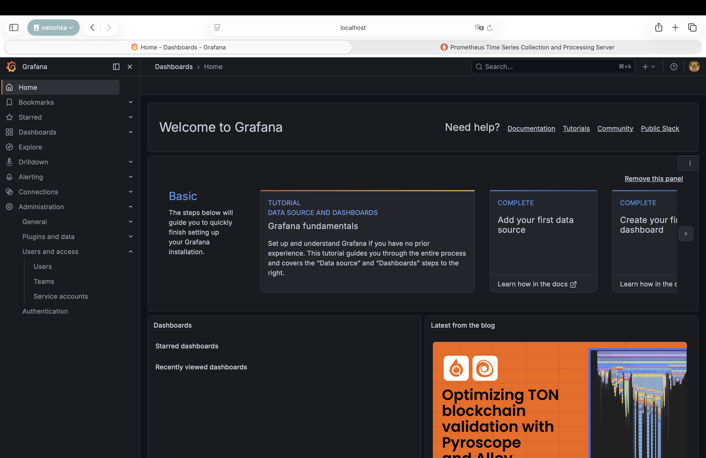
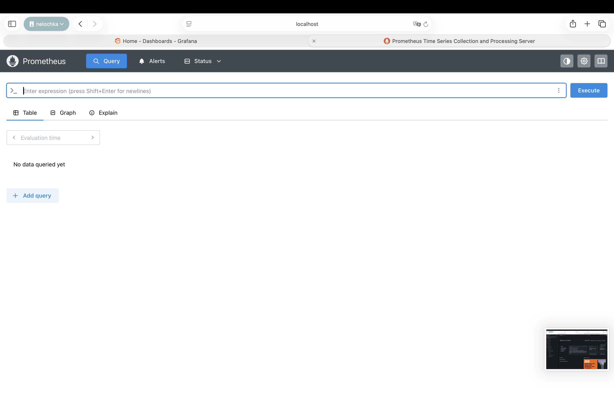

## Выполнение ДЗ № 8

**Задание 1: необходимо создать кастомный образ nginx, отдающий свои метрики на определенном endpoint:**

Создала [`nginx.conf`](nginx.conf)
Теперь нужно собрать образ, для этого создала [`dockerfile`](dockerfile) (взять готовый hginx и заменить конфиг на nginx.conf)

Создаю образ: 
```bash
eval $(minikube docker-env) # переключила Docker на использование внутри Minikub
docker build -t custom-nginx-metrics:1.0 . # образ собран
```
Проверка: 
```bash
docker images 
REPOSITORY                                TAG       IMAGE ID       CREATED         SIZE
custom-nginx-metrics                      1.0       4c38f146b87a   5 minutes ago   49.7MB
```

**Задание 2: установить в кластер Prometheus-оператор любым удобным вам способом**

Добавила репозиторий с Operator, с использованием helm chart установила Prometeus Operator: 
```bash
helm repo add prometheus-community https://prometheus-community.github.io/helm-charts
helm repo update

helm install prometheus-operator prometheus-community/kube-prometheus-stack \
  --namespace monitoring \
  --create-namespace
```
Проверка: 
```bash
kubectl get pods -n monitoring 
NAME                                                      READY   STATUS    RESTARTS   AGE
alertmanager-prometheus-operator-kube-p-alertmanager-0    2/2     Running   0          4m49s
prometheus-operator-grafana-645c7778dd-fqzbn              3/3     Running   0          5m16s
prometheus-operator-kube-p-operator-75ff94dcd-225jl       1/1     Running   0          5m16s
prometheus-operator-kube-state-metrics-59bfd878cb-ml5nl   1/1     Running   0          5m16s
prometheus-operator-prometheus-node-exporter-9jgl7        1/1     Running   0          5m16s
prometheus-prometheus-operator-kube-p-prometheus-0        2/2     Running   0          4m49s
```
Сделала (из kubectl get svc -n monitoring ): 
```bash
kubectl port-forward svc/prometheus-operator-grafana 3000:80 -n monitoring
kubectl port-forward svc/prometheus-operated 9090:9090 -n monitoring
```
Теперь локально запускаются: 
```bash
http://localhost:9090 # prometheus
http://localhost:3000/ # grafana
```
Для Графаны нужно найти пароль (secret): 
```bash
kubectl get secret prometheus-operator-grafana -n monitoring -o jsonpath="{.data.admin-password}" | base64 --decode
```
Выполнила вход, сменила пароль в Grafana (admin/admin)




**Задание 3: создать deployment, запускающий мой кастомный nginx образ и service для него**

Создала [`deployment.yaml`](deployment.yaml), [`service.yaml`](service.yaml), запустила. Проверила: 
```bash
kubectl get pods 
NAME                                             READY   STATUS    RESTARTS   AGE
custom-nginx-bd94cc6cf-x7ltd                     1/1     Running   0          23s

kubectl get svc
NAME           TYPE        CLUSTER-IP      EXTERNAL-IP   PORT(S)    AGE
custom-nginx   ClusterIP   10.110.169.98   <none>        8080/TCP   51s
kubernetes     ClusterIP   10.96.0.1       <none>        443/TCP    42h
```
Пробросила порт на лок хост: 
```bash
kubectl port-forward svc/custom-nginx 8080:8080
```
При открытии страницы в браузере curl http://localhost:8080/metrics , убедилась, что возвращается: Hello from custom nginx. 


2. [`values.yaml`](homework-chart/values.yaml)
   